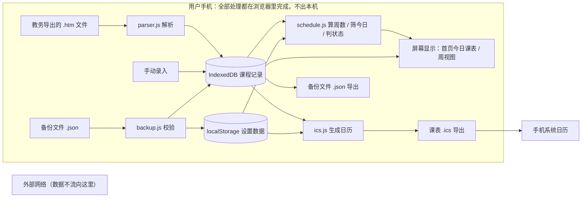

# WG课程表 · TECH_DESIGN（技术设计文档）

| 项目 | 手机端实时课表（面向大学生） |
| --- | --- |
| 文档 | `TECH_DESIGN.md` |
| 日期 | 2026-09-20（训练营 Day 5）；2026-09-23 修订（Day 8） |
| 版本 | v1.1 |
| 上游文档 | `PRD.md`（Day 4 产品需求）—— 技术方案以实现其 F1–F8 为唯一目标 |
| 下游 | 开发阶段（Day 6 起），按 PRD 第 7 节 T1–T11 顺序推进 |
| 本文不涉及 | 任何业务代码、页面视觉样式、PRD 范围变更 |

## 0. 一句话技术路线

> **用原生 HTML / CSS / JavaScript 写三个静态网页，课表数据存在用户自己的浏览器里，文件托管在 GitHub Pages 上——没有后端，没有服务器数据库，没有服务器。**

这条路线与 PRD 的四个约束一一对应：数据只存本机、无任何网络请求、不用注册、断网可用。
**取舍代价**：没有云同步，换手机需靠备份文件手动迁移（PRD 已用 F6 备份 + F8 导出日历两个功能兜住）。

## 1. 技术选型与理由

四项选型逐一说明「选了什么、为什么、代价是什么、否决了什么」。

### 1.1 前端：原生 HTML + CSS + JavaScript

| | |
| --- | --- |
| **选型** | 原生 HTML / CSS / JavaScript（ES2020+），**不使用框架，不使用构建工具** |
| **为什么** | ① 规模匹配：全项目 3 个页面、8 项功能，DOM 操作量小，框架带来的「组件化」收益抵不上它的学习成本；② 去掉构建流程：没有 npm、没有打包，「改完存盘 → 刷新浏览器」就能看到结果，出错时只需排查一层；③ PRD 第 7 节已把工作拆成 T1–T11 各 ≤1 天，框架会把 T1 之前的准备期拉长 |
| **代价** | 页面复杂后会比框架难维护；没有组件复用机制，公共 UI 需手写函数复用 |
| **否决** | React + Vite（方案 B）：本项目收益低、成本高，且会让 28 天里「学工具」挤占「做功能」的时间。若后续页面数增长到 6 个以上，可重新评估 |

### 1.2 后端：不要

| | |
| --- | --- |
| **选型** | **无后端** |
| **为什么** | 后端存在的四个理由在本项目全部不成立：① 没有要藏的密钥（无支付、无第三方接口）；② 没有要判断的资格（只服务本人，用户自己就是数据的所有者）；③ 没有多人共享同一份数据的需求；④ 没有只在服务器上才能做的活（课前提醒由 F8 导出 `.ics` 交给系统日历，无需自建推送）。详见 PRD 第 6 节。 |
| **代价** | 无法云同步；无法多设备共享；无服务端侧的统计与监控（本期不需要） |
| **否决** | CloudBase Node.js 云函数：一旦引入，数据必须离开手机，直接违反 PRD 第 8 节验收 F3「无任何网络请求把课表内容发送到外部」，也违背 PRD 第 2 节「把课表当隐私，不想上传服务器」 |

### 1.3 数据存储：浏览器本机

| | |
| --- | --- |
| **选型** | 课程数据存 **IndexedDB**；设置数据存 **localStorage** |
| **为什么** | 两者都是浏览器自带的本机存储，都不联网。分开的理由：**课程数据**条数多（一学期 20–40 门课、逐次课展开后约 100–300 条记录）且未来可能增长（多学期、调课历史），IndexedDB 容量无实际上限、异步 API 不阻塞界面，适合当「主数据库」；**设置数据**只有 2 个字段（学期起始日、节次时间表），结构简单、读写频繁，localStorage 的同步 API 用起来最省事 |
| **代价** | 需要同时维护两套存储 API（由 `storage.js` 统一封装，上层不感知）；IndexedDB 的异步写法对零基础有一定学习成本 |
| **降级路径** | 若开发到 T4 时发现 IndexedDB 上手过慢，**可整体退化为 localStorage**——100–300 条记录的 JSON 约 50KB，远低于 5MB 上限，完全可行。届时只改 `storage.js` 与 `model.js`，页面代码不用动 |
| **否决** | 服务器数据库 PostgreSQL：违反 F3；也超出本期需要 |

### 1.4 部署：GitHub Pages 静态托管

| | |
| --- | --- |
| **选型** | GitHub Pages（仓库 `XJLZR/WG-KeChengBiao`，公开访问） |
| **为什么** | ① 仓库已在 GitHub，不新增平台与账号；② 零成本、零维护；③ 自带 HTTPS——**PWA 与 Service Worker 强制要求 HTTPS**，这条省掉自配证书的麻烦；④ 与 Git 工作流天然打通：推送即发布 |
| **代价** | 只能托管静态文件（本项目正好只需要这个）；国内访问速度不稳定；访问地址带仓库子路径（见 6.4 已知坑） |
| **否决** | CloudBase 静态托管：功能够用且国内速度更好，但需要注册腾讯云账号，本期按「不引入新账号」处理。若国内访问速度影响真机验证（T9），可随时迁移——因为产物只是静态文件，**迁移零改代码** |

**方案对比留痕**（决策依据，非候选）：

| | 方案 A（已选） | 方案 B | 方案 C |
| --- | --- | --- | --- |
| 前端 | 原生 JS | React + Vite | React + Vite |
| 后端 | 无 | 无 | 云函数 |
| 数据 | 浏览器本机 | 浏览器本机 | PostgreSQL |
| 与 PRD 一致性 | 完全一致 | 一致 | **冲突** |
| 否决主因 | — | 学习成本高于收益 | 违反 F3 与隐私立场 |

## 2. 项目结构

采用**多页面（MPA）**结构：PRD 定义 3 个页面，一页一个 HTML 文件，页面跳转用普通链接。

> **为什么不用单页应用（SPA）**：SPA 需要一个路由机制来「在不刷新页面的情况下假装在换页」，等于额外引入一套逻辑。3 个页面用链接跳转最直观，浏览器前进/后退天然可用。代价是每个页面都要重复引入公共 JS——但浏览器会缓存这些文件，PWA 场景下几乎无感。

```
WG-KeChengBiao/
├── index.html            首页（今日课表）—— P1，对应 V1.1–V1.6
├── import.html           导入页 —— P2，对应 V2.1–V2.4
├── settings.html         设置页 —— P3，对应 V3.1–V3.2
├── manifest.json         PWA 清单（图标、名称、全屏声明）
├── sw.js                 Service Worker（缓存静态资源，保证断网可用）
├── css/
│   ├── base.css          变量、重置、字体、通用间距
│   └── pages.css         三个页面的布局与组件样式
├── js/
│   ├── model.js          数据结构的定义与默认值（课程记录、设置）
│   ├── storage.js        本机读写的唯一出口（IndexedDB + localStorage 都封装在这里）
│   ├── parser.js         .htm 课表文件 → 课程记录（含两位切分、周次集合、合并规则）
│   ├── schedule.js       周数计算、今日筛选、课程状态判定、下一节课
│   ├── ics.js            .ics 日历文件生成
│   ├── backup.js         备份导出 / 导入（含格式校验）
│   ├── ui-home.js        首页：视图切换与渲染
│   ├── ui-import.js      导入页：预览、确认、替换
│   └── ui-settings.js    设置页：起始日期、节次时间表、数据管理
└── icons/
    ├── icon-192.png      PWA 图标（192×192）
    └── icon-512.png      PWA 图标（512×512）
```

**分层原则**：`ui-*.js`（界面）只能调用 `storage.js` / `schedule.js` / `parser.js` / `ics.js` / `backup.js`（逻辑），**不直接碰 IndexedDB 或 localStorage**。这样将来换存储方式，只改 `storage.js` 一个文件。

## 3. 数据模型

数据结构是 PRD 第 5 节「数据字段」的技术落地。

### 3.1 课程记录（Course）

| 字段 | 类型 | 必填 | 说明 |
| --- | --- | --- | --- |
| `id` | string | 是 | 唯一标识，用于增删改。生成规则：`星期-节次串-课程名-地点` 拼接（同一门课跨周次合并后仍是一条，id 稳定） |
| `name` | string | 是 | 课程名 |
| `weekday` | number | 是 | 星期，1–7（1 = 周一） |
| `periods` | number[] | 是 | 节次数组，如第 6–7 节存为 `[6,7]`；来源是文件里的两位串（`0607` 按 01–12 两位切分） |
| `location` | string | 否 | 上课地点。**空字符串表示「无」**，页面显示「—」（PRD 验收 A4） |
| `teacher` | string | 否 | 教师。空字符串时该位置**留空，不显示占位符**（PRD 5.1） |
| `weeks` | number[] | 是 | 周次集合，如 `[1,5,9,13]`。**不是「起止周 + 单双周」**（真实数据存在不规则周次，PRD 5.1） |
| `className` | string | 否 | 班级名称 —— 解析时保留，本期不显示、不参与功能 |
| `scheduleDate` | string | 否 | 排课日期 —— 解析时保留，本期不使用 |
| `courseOrder` | string | 否 | 课序 —— 解析时保留，本期不使用 |
| `type` | string | 否 | 类型 —— 解析时保留，本期不使用 |

**两条数据规则**（PRD 5.1 已定死，解析与手动录入都必须遵守）：

1. **合并规则**：同课程名 + 同星期 + 同节次 + 同地点 → `weeks` 取并集合并为一条；**地点不同的记录不合并**（避免把「同一门课换教室」错误并掉）。
2. **冲突兜底**：同一时间段（同星期 + 同节次 + 同周次）出现两门不同课程时，**不做冲突提示、不自动裁决**，两条都显示。

### 3.2 设置数据（Settings）

| 字段 | 类型 | 默认值 | 说明 |
| --- | --- | --- | --- |
| `semesterStart` | string | `"2026-08-31"` | 学期第一周周一的日期（`YYYY-MM-DD`），周数计算的基准，用户可改 |
| `periodTimes` | array | 见下 | 第 1–12 节的起止时间，共 12 项，每项 `{ "start": "HH:MM", "end": "HH:MM" }` |
| `schemaVersion` | number | `1` | 数据结构版本号，用于升级（见第 8 节） |

`periodTimes` 是「正在上课 / 未开始 / 已结束」与「下一节课」的计算依据，**没有它这三个状态都算不出来**（PRD F5）。

> **待确认（信息不足）**：本校第三节的作息时间需用户提供，或采用一版通用作息作初始值。默认值不影响结构，只影响首次使用的准确度。

### 3.3 存储结构

| 存什么 | 存在哪 | 结构 |
| --- | --- | --- |
| 课程记录 | IndexedDB：数据库 `wg-timetable` → 对象仓库 `courses`（`keyPath: "id"`） | 每条记录一个对象，字段同 3.1 |
| 设置数据 | localStorage：键 `wg.settings` | 3.2 的 JSON 字符串 |

**为什么两个存储都要通过 `storage.js`**：上层代码调用的是 `getCourses()` 这样的函数，不是 `indexedDB.open()`。这样存储方式一旦变化（比如降级为 localStorage），改动被限制在一个文件里。

## 4. 接口列表

### 4.1 为什么没有 API

**API 的前提是「前端与后端约定一套远程调用」。**本项目没有后端（见 1.2），所有逻辑在同一台设备的同一个浏览器里跑完，不存在跨机器调用，因此**不存在网络 API，也不存在接口地址、请求方法、状态码这些概念**。

替代它的是「模块间接口」——即每个 JS 文件对外暴露哪些函数。对开发来说，这才是本项目真正需要约定的东西。

### 4.2 模块间接口（开发约定）

| 模块 | 函数 | 输入 | 输出 | 调用方 |
| --- | --- | --- | --- | --- |
| `storage.js` | `getCourses()` | — | `Promise<Course[]>` | 所有 ui-*.js |
| | `saveCourses(courses)` | `Course[]` | `Promise<void>` | ui-import.js |
| | `addCourse(course)` / `updateCourse(course)` / `deleteCourse(id)` | 课程 / id | `Promise<void>` | ui-import.js（V2.4） |
| | `getSettings()` | — | `Settings` | 所有 ui-*.js |
| | `saveSettings(settings)` | `Settings` | `void` | ui-settings.js |
| | `clearAll()` | — | `Promise<void>` | ui-settings.js（清空数据） |
| `parser.js` | `parseTimetableHtml(text)` | 文件文本 | `{ courses, stats }` 或抛错 | ui-import.js |
| `schedule.js` | `getWeekNumber(settings, date)` | 设置、日期 | `number` 或 `null`（非教学周） | ui-home.js |
| | `getCoursesOfDay(courses, weekday, week)` | 课程、星期、周数 | `Course[]`（按节次排序） | ui-home.js |
| | `getCourseStatus(course, settings, now)` | 课程、设置、时刻 | `"ended"｜"ongoing"｜"upcoming"` | ui-home.js |
| | `getNextCourse(list, settings, now)` | 今日课程、设置、时刻 | `Course` 或 `null` | ui-home.js |
| `ics.js` | `generateIcs(courses, settings)` | 课程、设置 | `string`（.ics 内容） | ui-settings.js |
| `backup.js` | `exportBackup()` | — | `string`（JSON） | ui-settings.js |
| | `importBackup(text)` | JSON 文本 | 校验结果 + 写入 | ui-settings.js |

**约定**：所有可能失败的操作，**不靠抛异常传递用户可见信息**，而是返回明确结果或抛出带 `code` 的错误对象，由 `ui-*.js` 翻译成中文提示（见第 6 节）。

### 4.3 若将来上后端，API 会长什么样（预告）

仅作留痕，本期不实现。届时会出现这些接口：

| 场景 | 可能的接口 | 触发条件 |
| --- | --- | --- |
| 云同步 | `GET /courses`、`PUT /courses` | 用户要求多设备同步 |
| 账号 | `POST /login` | 同上 |
| 班级共享课表 | `GET /classes/{id}/timetable` | 出现「看同班课表」需求 |

**影响范围**：`storage.js` 需增加远端读写分支、新增 `api.js`、需要引入环境变量与密钥管理（见第 5 节）、PRD 第 8 节 F3 验收标准需改写。**其余文件（`parser.js` / `schedule.js` / `ics.js` / 页面）不受影响**——这正是 2 节「分层原则」的价值。

## 5. 环境变量

### 5.1 当前路线：不适用

**本项目没有环境变量，也不应该有。**

理由：环境变量的唯一用途是**把「配置」和「密钥」从代码里拿出来**，好在不同环境（开发/生产）之间切换、且不把敏感信息提交进 Git。本项目：

1. 没有密钥 —— 没有第三方接口、没有数据库密码、没有推送证书；
2. 没有多环境 —— 本地打开 `index.html` 就是开发环境，GitHub Pages 就是生产环境，两边跑的是同一份文件，没有任何需要切换的配置。

> 提醒：**不要为了「看起来专业」而硬造 `.env` 文件**。纯静态项目里出现 `.env` 通常意味着有东西被藏错了地方。

### 5.2 若将来走全栈路线：需要什么

| 变量 | 用途 | 纪律 |
| --- | --- | --- |
| `CLOUDBASE_ENV_ID` | 云开发环境 ID | 可公开，但仍建议抽出来 |
| `DB_CONNECTION` | 数据库连接串 | **绝不进仓库** |
| `SECRET_KEY` | 服务端密钥 | **绝不进仓库** |

**纪律（与 PRD 验收 F1 同源）**：任何密钥、`.env`、连接串都不进代码、不进提交。本地用 `.env`（已在 `.gitignore` 中），部署时用平台的配置面板注入。

## 6. 错误处理

### 6.1 三条原则

1. **用户看懂的，和开发看懂的，分开**。用户看到一句中文说明「发生了什么、下一步做什么」；技术细节（堆栈、错误码）只进 `console.error`。
2. **错误要分类型，不要一句话兜所有情况**。PRD 验收 A3 与视图 V2.3 明确要求「区分原因」。
3. **失败不能留下脏数据**。任何写入前先完成全部校验；解析失败时**不写入任何内容**（PRD A3「不写入脏数据」）。

### 6.2 错误清单

| 场景 | 触发条件 | 用户看到 | 内部动作 |
| --- | --- | --- | --- |
| 文件读取失败 | 用户选的文件无法读取 | 「这个文件读不出来，请重新选择」 | catch FileReader 错误 |
| 不是课表文件 | 内容里找不到课表表格特征 | 「这不像教务系统导出的课表文件」，附「怎么导出」的三步说明 | 解析前置校验失败 |
| 解析到 0 条课程 | 表格结构对上了，但没提出任何课程 | 「没解析出课程，可能文件不是本学期课表」 | 返回 0 条时视为失败 |
| 文件为空 | 文件内容为空或只有空白 | 「这个文件是空的」 | 长度校验 |
| 数据保存失败 | IndexedDB 写入失败（无痕模式、配额满） | 「数据没能保存到本机，可能浏览器禁用了本地存储」 | catch 写入异常，**保留内存中的旧数据** |
| **本机数据读取失败** | 读本机数据时抛错，或读到的数据无法识别（结构不对、`schemaVersion` 高于当前程序）。对应 PRD 视图 **V1.8** | 「没能读到本机保存的课表」+ 一句原因 + **「重试」按钮**；**不得显示成「还没有课表数据」（V1.5）**，也不得白屏 | 向上抛出带 `code` 的错误对象（见下方错误码）；**不吞异常、不返回空数组**——返回空数组会被当成「从未导入过」 |
| 备份文件无法识别 | 导入的备份 JSON 结构不对 | 「这个备份文件无法识别，请选择本应用导出的文件」 | 结构校验失败即中止 |
| 备份版本不匹配 | 备份的 `schemaVersion` 高于当前程序 | 「备份文件来自更新版本，请先更新页面」 | 拒绝导入，避免误伤数据 |
| 手动录入校验失败 | 课程名空、节次未选、周次为空 | 在字段旁提示具体哪一项没填 | 表单前置校验 |

**读取失败的错误码**（`error.code`，与 4.2 结尾「抛出带 `code` 的错误对象」的约定一致；`ui-home.js` 按它选中文文案）：

| `code` | 含义 | 用户看到 |
| --- | --- | --- |
| `DATA_CORRUPT` | 本机保存的数据结构不完整、字段类型不对 | 「本机保存的数据结构不完整，可能被改动过」 |
| `DATA_VERSION_UNSUPPORTED` | `schemaVersion` 高于当前程序认识的版本 | 「本机数据的版本比当前页面新，请刷新页面或更新程序」 |
| 其他 / 无 `code` | 读取过程本身出错（存储打不开等） | 「读取本机数据时出错，请稍后重试」 |

### 6.3 降级与兜底

- **存储不可用**（无痕模式）：仍允许「本次会话内查看」，但明确提示「关闭页面后数据会丢失」。
- **周数算不出来**（未设学期起始日）：使用默认值 2026-08-31，并在设置页提示去确认。
- **「降级」与「读取失败」的分界**（PRD 视图 V1.7 / V1.8）——判据是「**这次会话还能不能继续用**」：
  - 还能用 → **降级**：正常显示课表，另给一句提示。例：无痕模式下存储不可用，本次会话内照常查看 + 提示「关闭页面后数据会丢失」。
  - 不能用 → **错误页（V1.8）**：数据损坏、版本不认、读取抛错，显示原因与「重试」按钮。
  - **两者不可混用**：读取失败**不能**落到 V1.5「还没有课表数据」——那个视图的含义是「从未导入过」，混用会让用户以为自己的课表丢了。
- **加载中的显示时机**：读取耗时**超过 250ms** 才显示（PRD V1.7）。本机读取通常只要几十毫秒，一进入就显示加载页会一闪而过，比不显示更糟。

### 6.4 已知坑（开发时必须注意）

| 坑 | 说明 | 规避方式 |
| --- | --- | --- |
| **子路径部署** | GitHub Pages 地址形如 `https://xjlzr.github.io/WG-KeChengBiao/`，带一层子路径。若资源引用写成绝对路径 `/css/base.css`，会指向 `xjlzr.github.io/css/base.css` 而 404 | 全部使用**相对路径**（`./css/base.css`）；`manifest.json` 的 `start_url`、`sw.js` 的注册路径同理 |
| **Service Worker 更新滞后** | sw.js 缓存了旧文件后，改代码刷新看不到变化，容易误判「代码没生效」 | 每次发布递增缓存版本号；开发时用「清除站点数据」或 DevTools 的 Update on reload |
| **`.ics` 时区** | 不加时区的时间可被系统按当地时间解释，加了错误时区会整体偏差几小时（影响验收 D7） | 采用「浮动时间」格式（不带 `Z`、不带 `TZID`），交由系统按本地时区解释；真机抽查 3 节课核对 |
| **连堂课跨行** | 第 1–4 节的课在周视图要跨 4 行，网格布局易错位（影响验收 C3） | 周视图用 CSS Grid 的 `grid-row: span N`，不用绝对定位 |
| **周次不规则** | `1,5,9,13` 这类周次展开成日历时不能按「起止周」处理（影响验收 D8） | `weeks` 一律按数组逐项处理，不假设连续性 |
| **iOS 路径** | PRD 第 2 节已明确本期不覆盖 iOS | 不做 iOS 适配与验证 |

## 7. 数据流

### 7.1 数据流图



### 7.2 文字版（无渲染环境可读）

```
【数据从哪来】三个入口
  ① 教务系统导出的 .htm 文件  → parser.js 解析
  ② 手动录入（课程表单）
  ③ 备份文件 .json            → backup.js 校验

【存到哪】两个柜子
  课程记录  → IndexedDB
  设置数据  → localStorage

【到哪去】四个出口
  ① 首页「今日课表」 ← schedule.js 读取「课程 + 设置」后计算
  ② 周视图网格       ← 读取课程后按「星期 × 节次」排列
  ③ 备份文件 .json   ← 从 IndexedDB 导出，下载到手机
  ④ 课表 .ics        ← 由「课程 + 设置」生成，下载后导入手机系统日历

【一句话】
  数据从用户自己导入的文件（或手动录入）来，存进浏览器本机的两个存储里，
  被读取后算好、显示到屏幕上，或导出成文件交到用户手上。全程不出本机。
```

### 7.3 怎么读这张图

1. **左边是「从哪来」，右边是「到哪去」**。中间两个圆柱体是数据待的地方。
2. **所有方框都在同一个灰色边框里**——这个框代表「用户手机上的这一个浏览器」。框内的一切都是本机动作，不涉及上传下载。
3. **图里唯一延伸到框外的只有右下角的「手机系统日历」**，而且它的箭头来自一个**文件**（`.ics`），意思是：数据不是被程序自动推过去的，是用户下载文件后**自己动手导入**过去的。这是 F8 的设计前提——白拿系统日历的提醒，但不引入任何服务端。
4. **左下那条带文字的虚线是刻意画的**：它标出数据**不会**流向的路径。外部网络节点与整条数据链路没有实线相连——对应 PRD 第 8 节验收 F3「无任何网络请求把课表内容发送到外部」。

### 7.4 这张图对应的代码

| 图上环节 | 落在哪个文件 |
| --- | --- |
| `parser.js 解析` | `js/parser.js` |
| `backup.js 校验` / `导出` | `js/backup.js` |
| `IndexedDB` / `localStorage` 读写 | `js/storage.js` |
| `schedule.js 计算` | `js/schedule.js` |
| `ics.js 生成日历` | `js/ics.js` |
| 三个出口的界面 | `index.html` + `ui-home.js`、`settings.html` + `ui-settings.js` |

## 8. 迁移与兼容

### 8.1 三个「版本号」要分清

| 版本号 | 管什么 | 存在哪 |
| --- | --- | --- |
| `schemaVersion` | **数据结构**的版本（字段增删改） | 设置数据里 + 备份文件里 |
| IndexedDB version | 数据库**仓库结构**的版本（对象仓库、索引变化） | `indexedDB.open(name, version)` |
| Service Worker 缓存版本 | **静态文件**的版本（保证用户拿到新版） | `sw.js` 里的缓存名常量 |

### 8.2 升级通道（同一条路走三遍）

数据可能来自三个地方：本机已有的旧数据、用户导入的旧备份文件、程序自带的新结构。升级策略是**统一走一个函数**：

```
1. 读入原始数据 → 2. 读出它的 schemaVersion → 3. 逐版本补齐（1→2→3……）
   → 4. 补上新增字段的默认值 → 5. 写回
```

这样「本机数据升级」和「旧备份导入」用同一段代码，不会出现「本机升级了、旧备份导进来却崩了」。

### 8.3 迁移纪律

1. **新增字段一律给默认值**，使旧数据无需人工干预即可用。
2. **不改名、不删字段**，除非同时把 `schemaVersion` 加 1 并写升级代码。字段改名是「不可逆变更」，会让旧备份文件彻底失效。
3. **备份文件必须带 `schemaVersion`**，导入时先看版本再决定是否接受（见 6.2）。
4. **升级前先提示备份**：涉及不可逆变更的版本，界面上提示用户先导出备份。

## 9. 与 PRD 的对应关系（可核对）

| PRD 项 | 落在哪 |
| --- | --- |
| F1 导入课表文件 | `import.html` + `parser.js` + `ui-import.js` |
| F2 手动录入 / 编辑 | `import.html`（V2.4）+ `storage.js` |
| F3 周视图 | `index.html`（V1.6）+ `ui-home.js` + `schedule.js` |
| F4 今日视图 | `index.html`（V1.1–V1.5）+ `schedule.js` |
| F5 学期设置 | `settings.html`（V3.1）+ `storage.js` |
| F6 数据存本机 + 备份 | `storage.js` + `backup.js` |
| F7 手机适配 + 加到主屏幕 | `manifest.json` + `sw.js` + `css/pages.css` + GitHub Pages |
| F8 导出 .ics | `ics.js` + `settings.html`（V3.2） |
| 验收 F1（真实文件不入库） | `.gitignore` |
| 验收 F3（无外部网络请求） | 技术选型本身（无后端、无第三方脚本、无外部字体/CDN） |

## 10. 待确认项（信息不足，先按临时假设推进）

| # | 待确认 | 临时假设 | 影响 |
| --- | --- | --- | --- |
| 1 | **节次时间表默认值**：本校第 1–12 节的具体作息 | 采用一版通用作息作初始值，用户可在设置页改 | 只影响首次使用准确度，不影响结构 |
| 2 | **学期最后一天如何确定**：PRD V1.3「非教学周」需要判断「晚于学期最后一天」，但 PRD 5.2 只提供了学期起始日 | 取所有课程 `weeks` 中的最大值作为最后教学周；课表为空时按 20 周兜底 | 影响 V1.3 的显示时机，需在 T5 前定 |
| 3 | **.htm 解析细节** | 以 `research.md` 第四节为准（两位切分规则、12 列表头） | 影响 T2 |
| 4 | 是否需要 `.ics` 时区字段 | 采用浮动时间，真机验证后再定 | 影响 D7 |

---

*本文为 Day 5 产出。技术路线严格对齐 `PRD.md`，未引入 PRD 之外的任何功能。第 7 节数据流图于本日后续板块补充。*
